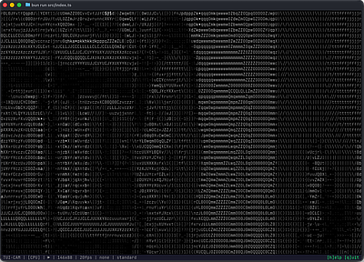
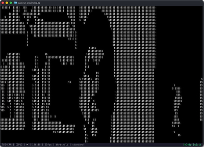

# tui-cam

Real-time ASCII webcam viewer for the terminal. Captures video from your webcam (or generates test patterns) and renders it as ASCII art using Unicode half-block characters for high-resolution output.

Built with [OpenTUI](https://opentui.com) and [Bun](https://bun.sh).

> "Why stream HD when you can stream `█▓▒░`?" — Ancient terminal wisdom

<!-- Screenshot: main webcam view -->



## Features

- **Live webcam capture** via ffmpeg — your face, now in glorious monochrome blocks
- **Real-time ASCII rendering** using Unicode half-block characters (2×vertical resolution because we're efficient like that)
- **6 image effects**: edges (Sobel), posterize, contrast, invert, threshold, none
- **5 character ramps**: standard, blocks, simple, detailed (70-char), braille dots
- **Supersampled rendering** mode for when regular sampling isn't extra enough
- **Mirror mode** — see yourself the way you see yourself in the mirror (confusing, we know)
- **Built-in mock camera** with animated test patterns for development (or for pretending you have a webcam)
- **GPU shader pipeline** (Three.js WebGPU) with automatic CPU fallback when your GPU is feeling shy
- **Interactive controls** with on-screen help overlay
- **Status bar** with FPS, resolution, effect, and pipeline info (so you know it's working hard)

<!-- Screenshot: edge detection or another effect -->



## Requirements

- [Bun](https://bun.sh) v1.3+ — The JavaScript runtime that's fast enough to make this nonsense work
- [ffmpeg](https://ffmpeg.org/) — For live webcam capture (not needed for `--mock` mode)
- **macOS** (currently uses AVFoundation for camera access)
  - Linux/Windows support would need different ffmpeg input flags (`-f v4l2` on Linux, `-f dshow` on Windows)
  - Pull requests welcome if you want to make this cross-platform!
- A terminal that supports Unicode half-block characters (most modern terminals do)
- A webcam (or the willingness to use `--mock` mode and pretend)

## Install

```bash
git clone https://github.com/anthropics/tui-cam.git
cd tui-cam
bun install
```

## Usage

### Live webcam

```bash
bun run start
```

### Mock camera (no webcam needed)

```bash
bun run start:mock
```

### CLI options

| Flag                 | Description                                                                      | Default       |
| -------------------- | -------------------------------------------------------------------------------- | ------------- |
| `--mock`             | Use mock camera with test patterns                                               | off           |
| `--pattern <name>`   | Mock pattern: `gradient`, `checkerboard`, `sinewave`, `noise`, `bars`, `circle`  | `gradient`    |
| `--fps <n>`          | Target frame rate                                                                | `24`          |
| `--resolution <WxH>` | Override output resolution (e.g. `120x60`)                                       | terminal size |
| `--effect <name>`    | Starting effect: `none`, `edges`, `posterize`, `contrast`, `invert`, `threshold` | `none`        |
| `--ramp <name>`      | Character ramp: `standard`, `blocks`, `simple`, `detailed`, `dots`               | `standard`    |
| `--mirror`           | Start with mirror mode on                                                        | off           |
| `--color`            | Enable color mode (ANSI color patterns)                                          | off           |
| `--no-gpu`           | Force CPU pipeline (disable GPU acceleration)                                    | off (GPU on)  |
| `--camera <index>`   | Camera device index for ffmpeg                                                   | `0`           |
| `--debug`            | Show debug stats in status bar                                                   | off           |

### Examples

```bash
# Webcam with edge detection
bun run src/index.ts --effect edges

# Mock camera, block characters, mirrored
bun run src/index.ts --mock --ramp blocks --mirror

# Webcam at 30fps with detailed ramp
bun run src/index.ts --fps 30 --ramp detailed

# Use a specific camera
bun run src/index.ts --camera 1
```

## Controls

| Key     | Action                    |
| ------- | ------------------------- |
| `Space` | Pause / Resume            |
| `E`     | Cycle effect              |
| `R`     | Cycle character ramp      |
| `M`     | Toggle mirror             |
| `S`     | Toggle supersample        |
| `P`     | Cycle pattern (mock mode) |
| `H`     | Toggle help overlay       |
| `Q`     | Quit                      |

## Can I use this as my video feed in a meeting app (e.g., Zoom)?

**Maybe!** But you'll need a virtual camera driver to pipe terminal output as a video source.

### The Technical Answer

tui-cam renders to your terminal (stdout), not to a video device. To use it in Zoom/Teams/Meet, you'd need to:

1. **Capture your terminal** as a video source using screen capture tools
2. **Create a virtual camera** that other apps can see
3. **Route the terminal capture** to that virtual camera

### Practical Options

**On macOS:**
- [OBS Studio](https://obsproject.com/) + [obs-mac-virtualcam](https://github.com/johnboiles/obs-mac-virtualcam) plugin
  - Run tui-cam in a terminal window
  - Use OBS to capture that specific window
  - Enable Virtual Camera in OBS
  - Select "OBS Virtual Camera" in Zoom/Teams

**On Linux:**
- [OBS Studio](https://obsproject.com/) + [v4l2loopback](https://github.com/umlaeute/v4l2loopback)
  - Similar workflow to macOS
  - v4l2loopback creates `/dev/video*` devices apps can use

**On Windows:**
- [OBS Studio](https://obsproject.com/) + built-in Virtual Camera
  - Same capture workflow

### Why This Is Hilarious

Your video call participants will see:
- You, rendered in Unicode blocks
- Delayed by ~100ms from the screen capture pipeline
- Compressed twice (once by the terminal renderer, once by Zoom)
- Probably triggering questions about your bandwidth

Will your coworkers understand? No.
Will they be impressed? Also no.
Should you do it anyway? **Absolutely.**

### Performance Notes

- Running tui-cam at higher FPS (e.g., `--fps 30`) helps with screen capture smoothness
- Use `--effect edges` for that "security camera footage from 1987" aesthetic
- The `--ramp blocks` option gives a nice chunky look that survives video compression better
- Expect your CPU fan to spin up — you're rendering video, capturing it, then re-encoding it

### Alternative: True Virtual Camera (Advanced)

For the truly dedicated, you could modify tui-cam to:
1. Render ASCII to an offscreen image buffer instead of terminal
2. Write raw frames to a virtual video device
3. Use libraries like `pam-diff` or `sharp` to generate image frames

This would skip the "capture terminal output" step but requires writing a virtual camera driver interface. At that point, you're basically building a new project. Which... actually sounds fun. Pull requests welcome! 🎥

## Architecture

### Pipeline Flow

```
Webcam (ffmpeg) / Mock patterns
  ↓
Raw RGBA frames (Uint8ClampedArray)
  ↓
Shader Pipeline (GPU via Three.js WebGPU OR CPU fallback)
  ├─ GPU: bun-webgpu → Metal/Vulkan (currently falls back to CPU for frame processing)
  └─ CPU: Pure JavaScript image effects
  ↓
Effect Processing (edges/Sobel, posterize, contrast, invert, threshold, none)
  ↓
Luminance Extraction (Float32Array, Rec.709 coefficients)
  ↓
ASCII Mapping (luminance → character ramp)
  ↓
OpenTUI drawGrayscaleBuffer() → Terminal (ANSI escape sequences)
```

### GPU Pipeline Status

The GPU pipeline uses Three.js WebGPU via [bun-webgpu](https://github.com/xhryom/bun-webgpu) bindings. Currently:

- ✅ **WebGPU adapter/device acquisition** works via subprocess probe (prevents FFI event-loop blocking)
- ✅ **Three.js renderer initialization** works in headless mode with mocked DOM
- ⚠️ **Frame processing** currently falls back to CPU (GPU readback from Three.js WebGPU in headless Bun is complex)

The infrastructure is in place for GPU-accelerated effects once `readRenderTargetPixelsAsync` becomes reliable in the bun-webgpu environment. For now, `--no-gpu` skips the probe entirely and goes straight to CPU.

**Why the fallback?** Reading pixels back from GPU textures in a headless (no-window) environment requires careful synchronization. Three.js WebGPU's `readRenderTargetPixelsAsync` exists but isn't well-tested in Bun's event loop. The CPU path is fast enough for real-time rendering (24-30 FPS), so this is a "nice to have" optimization, not a blocker.

### Code Structure

```
src/
  camera/
    types.ts              Frame + CameraSource interfaces
    mock-camera.ts        Animated test pattern generator
    ffmpeg-camera.ts      Live webcam via ffmpeg subprocess
  pipeline/
    shader-pipeline.ts    GPU pipeline + CPU fallback, factory
    effects.ts            Image effects (CPU implementations)
  ascii/
    ramps.ts              Character ramp presets
    ascii-mapper.ts       Luminance-to-character mapping
  app/
    viewport.ts           ASCII viewport (drawGrayscaleBuffer)
    status-bar.ts         Status display bar
    controls.ts           Keybindings
    app.ts                OpenTUI app composition
  config.ts               CLI argument parsing
  index.ts                Entry point
```

## Tests

```bash
bun test
```

## Credits

- [OpenTUI](https://github.com/anthropics/opentui) -- Terminal UI framework
- [Bun](https://bun.sh) -- JavaScript runtime
- [Three.js](https://threejs.org/) -- GPU shader pipeline
- [bun-webgpu](https://github.com/xhyrom/bun-webgpu) -- WebGPU bindings for Bun
- [ffmpeg](https://ffmpeg.org/) -- Video capture

## License

MIT
